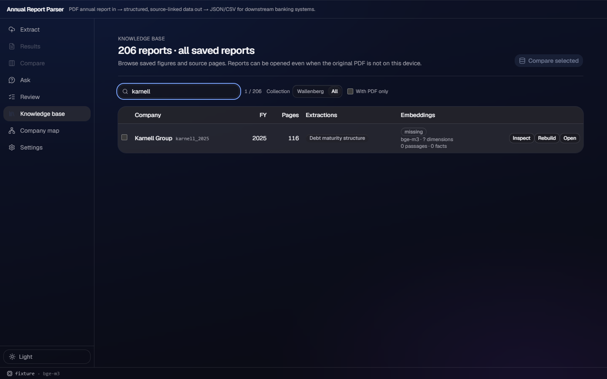
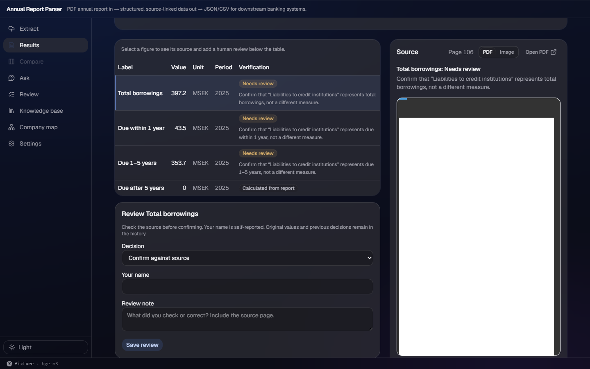
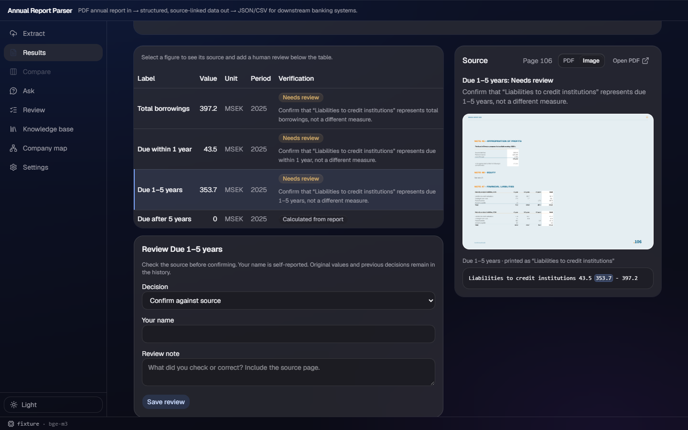

# Annual Report Parser — SEB challenge, Vivicta Finance & Insurance AI Hackathon 2026

An annual report's debt note in → **analyst material with sources** out: total interest-bearing
debt and when it falls due, every figure carrying the page it came from and the verbatim sentence
it was read from, exportable as PPTX/CSV/JSON for downstream banking systems. Web UI and a
double-click Windows app on top.

Scope decided with SEB's end user (Kristian, 15 Sept): the **debt maturity note** — one slide per
company, Nasdaq Stockholm Mid Cap. Challenge owner: Kimberly Lejonö, Co-Head CIB Data & AI Hub,
SEB. Full brief + meeting notes: [`docs/CHALLENGE.md`](docs/CHALLENGE.md).

| ① Open a saved report | ② Click a figure — buckets + page | ③ The source: quote on the page |
|---|---|---|
|  |  |  |

*The saved Karnell Group FY2025 debt record, captured on the fixture backend — no model configured
(dark tone, 1440×900); the page image in ③ comes from the PDF fetched onto that machine.*

## Try it in one minute — no model, no download

The repo ships 206 saved reports; 105 carry a stored `debt_maturity` extraction. Start the app by
any entry point below, open **Knowledge base** → set **Collection: All** → search `karnell` →
**Open** → click a figure: page number, verbatim quote, the sum check, review and PPTX/CSV export
all work offline, zero model calls. (Only page *images* need the PDF on disk.) The full demo
script — the two bundled samples, a three-minute line-by-line, and the demo-day checklist — is
[`docs/DEMO.md`](docs/DEMO.md).

## Install / run — three entry points

1. **Windows installer** (double-click, no toolchain): grab the Setup exe from the
   [`desktop-demo` release](https://github.com/Heffri/vivicta-seb/releases/tag/desktop-demo) —
   CI-built, checks for updates on startup and applies them on exit (the [`desktop-main`
   feed](https://github.com/Heffri/vivicta-seb/releases/tag/desktop-main) tracks `main`).
   Unsigned, so SmartScreen asks: "More info" → "Run anyway". Starts on fixture (demo) data; pick
   a real provider in Settings. Do not demo from the old portable `desktop-0.3.4` zip — it cannot
   update itself. Details: [`desktop/README.md`](desktop/README.md).
2. **`run.bat` (Windows) / `./run.sh` (macOS/Linux)** from a clone of this repo: first run sets up
   a Python venv, installs dependencies, builds the frontend, and opens the app in your browser on
   one port — about 2–4 minutes; later runs take seconds. Ctrl+C stops it (on Windows,
   `Terminate batch job (Y/N)?` is `cmd.exe`'s own prompt for any batch file — answer `Y`).
3. **From source, piece by piece** — backend venv + `uvicorn`, frontend dev server with `/api`
   proxy: see "Run it" below.

Docs: the API contract is [`docs/API.md`](docs/API.md); what the acrylic branch built and how to
verify it is [`docs/acrylic/README.md`](docs/acrylic/README.md); backend state is
[`docs/HANDOFF.md`](docs/HANDOFF.md).

## The one idea to keep

Every extracted number carries `source.page` + `source.quote`, and the backend checks the quote really exists on that page.
That is what makes this a bank tool and not a chatbot. Don't drop it.

## Layout

```
backend/    FastAPI + PyMuPDF + OpenAI-compatible LLM client (Ollama locally)   ← Chen, Boyu
frontend/   Vite + React 19 + Tailwind 4 + shadcn/ui                            ← Sebastijan
eval/       labels.csv + run.py → accuracy number                               ← Sara
docs/       API contract, challenge notes, prep for SEB meetings
data/reports/  bundled annual reports: index.json committed, PDFs gitignored -> `python data/fetch.py`
```

The handshake between frontend and backend is [`docs/API.md`](docs/API.md). Change it there first.

## Run it

`run.bat` / `run.sh` (entry point 2 above) does all of this in one step and serves frontend +
backend on a single port. To run each piece by hand instead (e.g. to use `--reload` while editing):

Backend (terminal 1):

```bash
cd backend
python -m venv .venv
# Windows: .venv\Scripts\activate    mac/linux: source .venv/bin/activate
pip install -r requirements.txt    # pymupdf pinned to 1.27.2.3 — why: docs/acrylic/evidence/v049.md
cp .env.example .env               # leave LLM_BASE_URL unset → returns the fixture (UI dev mode)
uvicorn app:app --reload --port 8000
```

Reports (once): `python data/fetch.py` downloads the annual reports listed in `data/reports/index.json`
(114 curated entries — Atlas Copco, Investor, Saab en/sv, SEB, SKF and the rest; ~130 MB). They show
up in `GET /api/library` and in the UI's library picker. None of this is needed for the saved-KB
walkthrough above; PDFs are only required for page images and *new* live extractions.

Frontend (terminal 2):

```bash
cd frontend
npm install
npm run dev                        # http://localhost:5173, proxies /api → :8000
```

Real extraction with a local model (using `run.bat`/`run.sh`? put the same lines in a `.env` file in
the repo root instead of `backend/.env` — either is picked up; `backend/.env` wins if both exist):

```bash
ollama pull qwen3:8b               # or qwen2.5:14b / qwen3:14b if you have ≥12 GB VRAM
# in backend/.env:
#   LLM_BASE_URL=http://localhost:11434/v1
#   LLM_MODEL=qwen3:8b
#   LLM_API_KEY=ollama
```

Same three variables point at Azure OpenAI / OpenAI / OpenRouter — no code change.

Or with the Codex CLI instead of a model endpoint (no local model; uses a Codex subscription/API key):

```bash
# in backend/.env:
#   LLM_PROVIDER=codex
#   LLM_MODEL=gpt-5.6-terra   # -m passed to `codex exec`; the CLI must be installed and already logged in
```

Or with the Claude Code CLI, same idea, for a Claude subscription (a Claude *API key* instead needs no CLI —
`LLM_PROVIDER=openai` + `LLM_BASE_URL=https://api.anthropic.com/v1/` + `LLM_API_KEY` already works):

```bash
# in backend/.env:
#   LLM_PROVIDER=claude
#   LLM_MODEL=claude-sonnet-5   # --model passed to `claude -p`; the CLI must be installed and already logged in
```

Extraction and Ask's answers then run on Codex/Claude — no base URL needed; without one, Ask's retrieval
falls back to keyword search (BM25), and an `LLM_BASE_URL` (Ollama/OpenAI-compatible) upgrades it to hybrid
embeddings+BM25 — see `backend/README.md`.

## Accuracy — the honest version

**Stored-library scores and first-extraction scores are two different claims.** They are kept
separate here, and the error *nature* is separate again.

**1) The stored library (curated).** `data/kb/` holds 105 stored `debt_maturity` extractions,
republished after every pipeline change under a "nothing loses on the hand-verified labels" gate.
That gate is exactly why this number is *not* a first-pass rate:

```bash
python eval/run.py --stored-kb data/kb --no-fail   # zero model calls, offline, reproducible
```

- Values **327/367 (89.1%)** — 271 hand-verified `debt_maturity` rows across 105 companies
  (the Mid Cap hardening universe plus the large-cap originals), plus 96 `income_statement` rows
  (income alone: 96/96 values, 92/92 cited pages)
- Cited pages **263/313 (84.0%)** (scored only where a value is cited)
- Debt section alone: values **231/271 (85.2%)**, pages **171/221 (77.4%)** — the headline number
  is pulled up by the income section; the debt number is the honest one for the scoped section
- Offline labelled-page coverage (all 276 debt rows with a page): locator candidates **263/276
  (95.3%)** → candidates plus the deterministic full-text field sweep **264/276 (95.7%)**
  ([w198](docs/acrylic/evidence/w198.md))

**2) First extraction (no labels at run time).** Three measured batches where the pipeline ran
without label access and was scored afterwards:

- 24 companies the locator had just made reachable: **9 → 14** fully-labelled companies
  ([v124](docs/acrylic/evidence/v124.md))
- 18 newly-labelled stems: stored 16/40 → **19/40** label fields after that round's publish set —
  the raw fresh runs scored 14/40 ([v136](docs/acrylic/evidence/v136.md))
- 28 remaining value-miss stems: 23/69 → **31/69** fields, pages 17/62 → 23/62
  ([v160](docs/acrylic/evidence/v160.md))

**3) What the errors are.** Of the 40 debt value misses in the stored library: **34 are empty**
(the field was not read, or was honestly declined) and **6 are non-empty but wrong**. An audit of
the disputed label candidates found **0 label errors**, **2 report-internal disagreements** (the
report itself prints two inconsistent totals — Green Landscaping, Volati) and **7 hard cases**
where the label is right and a named, bounded mechanism gap blocked the read
([v154](docs/acrylic/evidence/v154.md)). Scope calls that depend on Kristian's definitions
(carrying vs undiscounted, leases in/out) are disclosed per company, not silently resolved.

**4) Held-out first extraction (Small Cap, blind labels).** There are two separate ten-report
FY2025 samples, each labelled before its outputs were opened. **Round 1** (`seed=1`) scored 26/40
values and 8/17 cited pages at the shipped default (5 empty, 9 non-empty-wrong); it was
subsequently used to develop guard/tuning work and is no longer the current held-out benchmark.
**Round 2** (`seed=2`, excluding round 1's extracted-or-skipped companies) is the current
held-out sample: shipped-default `off` scored **36/40 (90.0%)** values and **14/17 (82.4%)** cited
pages (**1 empty**, **3 non-empty-wrong**), and the same frozen labels under non-default `majority`
scored the same 36/40 and 14/17. Neither n=10 measurement is a market-accuracy claim; see
[v178](docs/acrylic/evidence/v178.md) and [v190](docs/acrylic/evidence/v190.md).

**5) The boundary.** The 105 labelled companies have been used repeatedly to debug and tune this
pipeline — none of the numbers above is an out-of-the-box market-accuracy claim, and we do not
present them as one.

Other checks:

```bash
python eval/run.py --dry-run       # scores the fixture, no backend needed
python eval/run.py                 # runs the real pipeline over data/reports + eval/labels.csv
python scripts/random_check.py --n 10 --seed 1   # fetches 10 untuned Large Cap reports; how many parse at full confidence
```

## Desktop app

A double-click Windows app instead of a browser tab — same frontend, a packaged `backend.exe`, real
OS acrylic material on Windows 11. Install it from the [`desktop-demo`
release](https://github.com/Heffri/vivicta-seb/releases/tag/desktop-demo) (auto-updating), or build
it from `desktop/`: [`desktop/README.md`](desktop/README.md).

### Sharing saved reports with the hackathon team

`data/kb/` is the team's shared cache: report metadata, source page text, saved
extractions and reviews. The app opens these without re-extracting them. In
**Knowledge base**, choose **Collection → All** to see the full library. Extract
and Ask share this collection choice; Extract also offers **All companies**.

In Extract, type any company name and press Enter (or **Search**): the connected
Codex/Claude model resolves the text to concrete companies — "intel" becomes
Intel Corporation (NASDAQ: INTC) — shown as cards with ticker, country and the
report it found. **Use this company** downloads that PDF and extracts; **None of
these** re-runs the search with a hint. Saved reports appear first; feeds and
traditional search are fallback sources.
Ask lists saved text, nonempty extracted figures, and downloaded PDFs separately.
A catalog entry with no readable page text is excluded from Ask.

For the installed desktop app, close it and run from your checkout (Node required):

```powershell
node scripts/sync-team-data.js --dry-run
node scripts/sync-team-data.js
```

This copies new results between the installation and `data/kb/`. Review and commit
the changed files on a branch, then share through the usual PR. Teammates pull the
merged changes and run the same command. Reopen the app to load them. Merged data
also ships in the next automatic desktop update. This is Git sharing, not live sync.

Conflicting edits or different source PDFs are reported and left unchanged. Keep
the app closed while syncing; do not pull while extracting or reviewing. PDFs,
private uploads (`up-*`), credentials, logs, raw runs and derived embeddings stay
local. This repository is public: commit only reports and review notes intended
for it. A custom installation can use `--app-data <path-to-its-data-folder>`.

## How a section works

One JSON file per report section in `backend/schemas/` — fields, sv+en locator keywords, arithmetic checks.
The prompt is generated from it. **Adding a section = adding a file.** `debt_maturity.json` is the scoped section
(total interest-bearing debt + maturity buckets, decided with SEB's end-user Kristian on 15 Sept; output is a one-slide
PPTX per company via `GET /api/reports/{id}/extraction.pptx`). `income_statement.json` was the placeholder we hardened
the parser on. Current state and next steps for the backend team: [`docs/HANDOFF.md`](docs/HANDOFF.md).

## Pipeline (backend/pipeline)

```
parse.py    PDF → text per page
locate.py   schema keywords → candidate pages          (deterministic, no LLM)
extract.py  candidate pages + schema → LLM (JSON schema) → fields
            → provenance check (quote ∈ page text)
            → arithmetic checks from schema
```

Deferred until a demo breaks without it: ESEF/iXBRL cross-check, full vision fallback for scanned
tables (selective page OCR for text-less PDFs ships today — see `docs/PERFORMANCE.md`), async jobs,
DB, auth. Multi-report compare is no longer deferred: the Compare tab compares saved extractions
side by side, including the KB entries.
