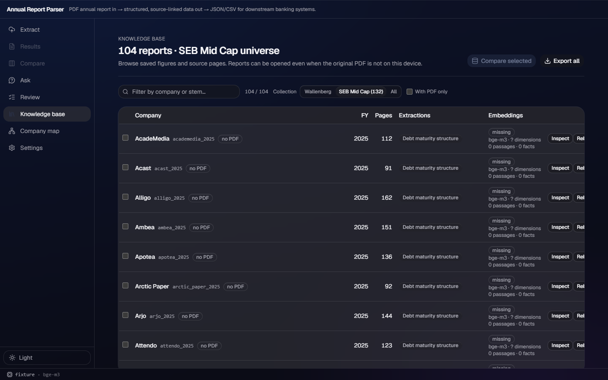

# v169 — SEB Mid Cap collection

## Delivered

- Added the third collection, `midcap`: the 132 `data/companies.json` records with
  `market == "Mid Cap"`, normalized through the existing `identity()` function and loaded once
  when `pipeline.collection` imports.
- `GET /api/companies`, `/api/library`, `/api/kb`, and `/api/review-queue` accept
  `collection_name=midcap`; the whole-KB CSV/PPTX exports accept `collection=midcap`. Their
  filters use the same `collection.scope()` predicate.
  Existing defaults remain unchanged: Wallenberg in the UI and review queue, `all` for the
  three existing backend list endpoints.
- Added the `SEB Mid Cap (132)` picker entry. Extract's directory hint, Ask's explicit
  saved-report scope, and the KB view inherit the expanded shared type. The KB heading now
  reads `n reports · SEB Mid Cap universe`.
- Documented all three collection values in `docs/API.md`, including the review-queue query.

## Scope boundary / follow-up for the group

`Map/Review 尚未接 useCollection(含 midcap)`: Map and Review are not in this lane's component
territory and were already fixed to their own defaults. The backend and typed API now accept
`midcap` for the future UI wiring.

## UAW reference

Reviewed `demo:src/workbench-shell/renderer/themes/theme-acrylic.css`, sections 1–3b
(`--bg-0`, `--blur`, and the one-thin-material rule). No CSS or layout was copied: this lane
only extends an existing segmented option and retains the established acrylic material.

## Verification

### Red → green

- **Red before implementation:** the Mid Cap membership assertion failed because
  `collection.members` did not exist.
- **Green after implementation:** `len(collection.members("midcap")) == 132`; Acast is in
  scope and ABB is not. `test_collection` also exercises Mid Cap KB, directory, and
  review-queue, and whole-KB export requests while retaining the Wallenberg assertions.
- Live fixture probe: Mid Cap Acast directory query returned one row; Mid Cap KB returned
  104 saved reports; Mid Cap review queue, library, and CSV export endpoints all returned successfully.

### Test gates

- **15 backend suites passed:** `pipeline.test_confidence`, `test_debt_selection`,
  `test_fetch`, `test_global_ask`, `test_kb`, `test_llm`, `test_locate`, `test_maturity_ocr`,
  `test_merge`, `test_parse`, `test_paths`, `test_runtime`, `test_collection`,
  `test_human_review`, and `test_workbench`.
- `npm run build` passed.
- `npm run lint` passed (advisory warnings only; exit 0).
- `npm run e2e` passed: **45 tests** on the merged tree. The focused collection workflow also passed: **6 tests**.
- Fixture mode only; no model inference was requested.

### Screenshot

`docs/acrylic/evidence/v169/kb-midcap-dark-final.png` shows the dark KB screen with
`104 reports · SEB Mid Cap universe`, the selected picker, and only Mid Cap entries.

## Data observation

The strict market rule yields 132 members, as required. Of 105 saved `debt_maturity` records,
104 match it: the remaining Ericsson record is `Large Cap` in the source catalog. No exception
was added and no source data was changed, so the collection remains exactly the requested
market-derived universe.
