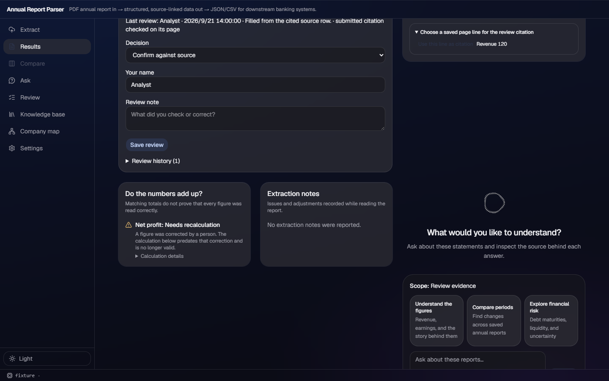
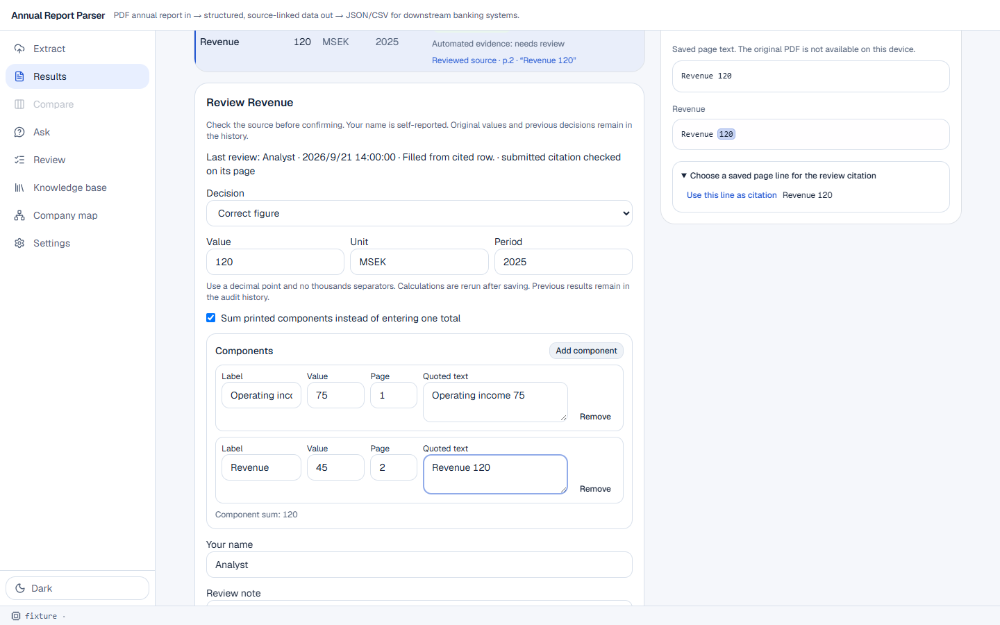

# v172 — review corrections carry their own evidence

## What changed

- A correction can submit a paired PDF page and verbatim quote. The review route validates that
  quote against the saved page text before replacing `field.source`; a mismatch returns 400 with
  the page number. The immutable prior value and source stay in `review_history`.
- A corrected total can instead contain cited components. Every component has a value, page,
  quote, and label; every quote is validated, the stored value is the exact component sum, and
  the first component supplies the clickable field source. These use `human_reviewed` plus
  `components_sum`, rather than pretending the sum was printed as one number.
- `human_review.source_verified` is written only for a submitted citation that passed page
  validation. A human decision without a new citation remains distinct from automated evidence.
- The results form has direct citation inputs, a small add/remove component table with a live sum,
  and Source's saved-text rows can populate the citation inputs. Reviewed sources are visible and
  selectable from the figures table.
- Per-report and whole-KB CSV exports add `human_source_page`, `human_source_quote`, and JSON
  `components`; JSON already carries the field, history, and components. PPTX shows the first
  verified human citation and component count while retaining full details in speaker notes.

## Screenshots

Both use the deterministic review fixture; no model or external report lookup was used.

The dark view shows the persisted human correction and the page's selectable saved-text source.

The light view shows two independently cited components and their live total, together with the
reviewed source that will remain clickable after saving.

## Red → green evidence

- **Red:** the pre-extension correction test expected cleared evidence and retained the old source;
  it failed once the new review-evidence assertion was introduced.
- **Green:** `backend/test_human_review.py` now proves a cited page replacement, a quote-not-on-page
  400, exact two-component summation, prior-source history, persisted reopening, CSV columns, PPTX
  text, stale expected-snapshot rejection, and re-extraction protection.
- The full backend set passed: 15 standalone suites (collection, human review, workbench, and all
  pipeline suites).
- Frontend gates passed: `npm run build`, `npm run lint` (existing repository warnings only), and
  `npm run e2e` (43 passed, 2 skipped).

## Integration

The two delivery merges of updated `team/main` each exposed a conflict in
`frontend/src/api.ts`. Both were resolved by retaining the team collection/maturity-wall imports
and the v172 review-component import; no other conflict needed resolution.
