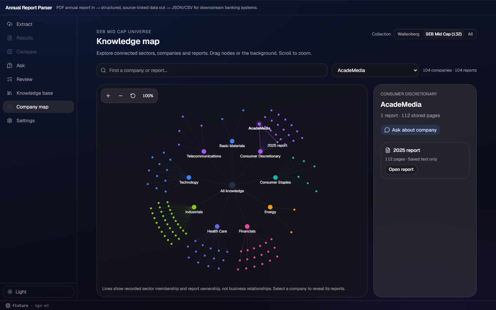
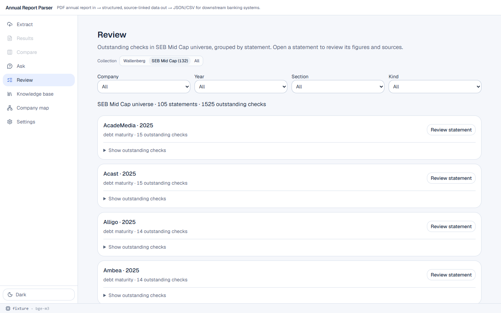

# v175 — Map and Review collection selection

## Delivered

- `KnowledgeMap` now reads the existing shared collection hook, places the existing
  `CollectionPicker` beside its title, and requests `getKb(collection)`. A changed
  selection clears the previous list while the requested collection loads; an empty
  collection now names its scope.
- `ReviewQueue` now uses the same hook and picker, sends the selection to
  `getReviewQueue(collection)`, and names the scope in both its description and
  statement/check count.
- The focused workflow test proves the Map company-node count changes from one to two
  for Wallenberg → All, then the Review statement-card count changes from two to one
  for All → SEB Mid Cap.

## UAW reference

Reviewed `demo:src/workbench-shell/renderer/themes/theme-acrylic.css`, sections 1–3:
the transparent fallback, acrylic tokens, and the one-thin-material rule. The UAW tree
contains no directly reusable collection, map, or review-queue component. This change
uses the established in-repository picker and existing acrylic surfaces, so it adds no
new material or CSS.

## Verification

### Red → green

- **Red:** before the component wiring, the new focused E2E test reached the Map with
  one Wallenberg company node but could not find a Collection control. This demonstrates
  that the Map did not expose or apply the shared scope.
- **Green:** after wiring both components, the focused test passed: `1 passed`.
  Its mocked API response verifies the Map's nodes and the Review queue's statement cards
  change with the selected collection.

### Full gates

- `npm run build` passed.
- `npm run lint` passed (exit 0; 10 existing advisory warnings).
- `npm run e2e` passed: **46 tests**.
- Fixture-only live probe: SEB Mid Cap returned 104 saved Map reports and 1,525 Review
  queue issues grouped into 105 statements. No model inference was requested.

## Screenshots

`docs/acrylic/evidence/v175/map-midcap-dark.png` visibly shows the selected SEB Mid Cap
picker, scope heading, and `104 companies · 104 reports` Map count.

`docs/acrylic/evidence/v175/review-midcap-light.png` visibly shows the same selected
picker, scope-aware count, and grouped review statements.

## Notes

- The backend already implements all three collection values; this lane only connects
  the existing typed frontend calls.
- The temporary fixture server did not leave tracked knowledge-base changes.
