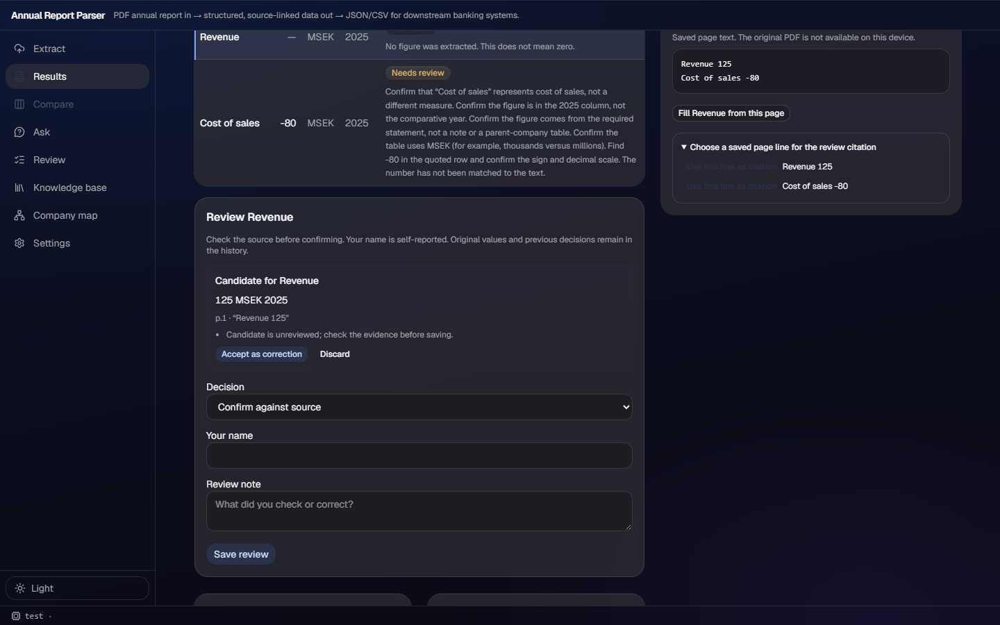

# v177 — analyst-directed one-field fill

## What changed

- `POST /api/reports/{report_id}/fill?section=` accepts `{field, pages}` for one or two analyst-selected evidence pages. It requires an existing, empty schema field; reviewed sections retain the existing 409 barrier, and fixture/demo mode returns the explicit 422 rather than synthetic evidence.
- The route calls `extract(..., fixed_pages=True)`, returns only the requested candidate plus warnings, requires its source quote to be on a supplied page, and never persists the candidate or changes another field. Its text reader deliberately avoids report registration, so the fill route does not write the knowledge base.
- `fixed_pages` bypasses `EXTRACT_TWO_PASS`, locator selection and the timeout narrowing fallback. The normal schema, model prompt, provenance, scope and arithmetic guards remain intact.
- Source keeps the last viewed evidence page when an analyst switches to an empty field. `Fill <field> from this page` asks for a candidate; the candidate card shows value, unit, period, page, quote and warnings. **Accept as correction** only copies those values into the existing v172 review form, where a human still supplies reviewer/note and saves through the normal stale-checked review route. Discard changes nothing.

## UAW reference check

I inspected `demo:src/workbench-shell/renderer/themes/theme-acrylic.css` and searched the UAW demo tree for source/review/citation controls before editing. There is no applicable renderer review-candidate component to copy; this change keeps the repository's existing acrylic cards, buttons and tokens rather than introducing a second material or copying dead/unwired code.

## Screenshot

The deterministic e2e route supplies a candidate only after its request assertion passes. The screenshot shows the selected empty Revenue field, its current saved page, the candidate's p.1 quote and the separate **Accept as correction** / **Discard** decisions. It is an interaction fixture, not a claim that this candidate came from a live model run.

## Red → green

- **Red:** after adding the route contract tests but before implementation, `python test_human_review.py` stopped with `AttributeError: module 'app' has no attribute 'fill_field'`.
- **Green:** `backend/test_human_review.py` now exercises the HTTP route: reviewed section → 409; demo mode → explicit 422; a fixed-page stub → target-only candidate shape, exactly one supplied page, no stored-extraction write; and an out-of-window source → `candidate: null` plus an explanatory warning. `pipeline.test_confidence` separately proves a fixed two-page window never invokes `_select_pages` even when `EXTRACT_TWO_PASS=1`.
- **UI green:** `frontend/e2e/tests/targeted-fill.spec.ts` intercepts `/fill`, asserts `{field: "revenue", pages: [1]}`, verifies the candidate card, checks that Accept fills (but does not save) the v172 correction form, then discards a second candidate.

## Real experiment — preselected M-bucket pages

Authorized live configuration: Codex provider, `gpt-5.6-terra`, carrying basis, merge off, fixed one-page windows. Each request made one model call; no retries or writes to `data/` occurred. The eight rows are distinct M-bucket hard cases from v150, with the analyst page equal to the labelled evidence page.

| report | empty field | selected page | HTTP | result | seconds |
|---|---|---:|---:|---|---:|
| Ratos | total debt | 131 | 200 | no candidate | 13.19 |
| Ovzon | total debt | 61 | 200 | no candidate; parent-section guard declined the table | 14.67 |
| BioInvent International | due 1–5 years | 66 | 200 | no candidate | 11.81 |
| Öresund | due within 1 year | 47 | 200 | no candidate | 9.62 |
| Byggmästare A J Ahlström | due after 5 years | 54 | 200 | no candidate | 14.38 |
| Green Landscaping | due after 5 years | 102 | 200 | no candidate | 11.78 |
| Viva Wine | due within 1 year | 79 | 200 | no candidate | 11.04 |
| Dustin | due within 1 year | 100 | 200 | no candidate | 11.29 |

**Outcome:** 8 reports, **0 successful fills**, **0 HTTP errors**, 8 valid no-candidate responses, **8 Terra calls** and 97.78 s total (12.22 s mean). The source/provenance and scope guards did not fabricate or silently apply a result, which is the intended safety property; however, this selected hard-case set provides no evidence that the path currently rescues difficult stored nulls. It is therefore worth showing only as a controlled analyst/review workflow, not as a live-demo claim of recovery rate, until a later bounded experiment yields reviewed candidates.

## Gates and boundaries

- Backend: all 15 standalone suites green — 12 pipeline suites plus collection, human-review and workbench.
- Frontend: `npm run build` green; `npm run lint` green with only the repository's pre-existing warnings; `npm run e2e` green: 44 passed, 2 skipped (46 total).
- `git status --short data data/kb` was empty after the live calls; no schema, locator or data file was changed.
- Changed implementation/contract paths: `backend/app.py`, `backend/pipeline/extract.py`, `backend/pipeline/test_confidence.py`, `backend/test_human_review.py`, `frontend/src/api.ts`, `frontend/src/types.ts`, `frontend/src/components/ResultsView.tsx`, `frontend/src/components/results/SourcePanel.tsx`, `frontend/src/components/results/HumanReviewForm.tsx`, `frontend/e2e/tests/targeted-fill.spec.ts`, and `docs/API.md`.
