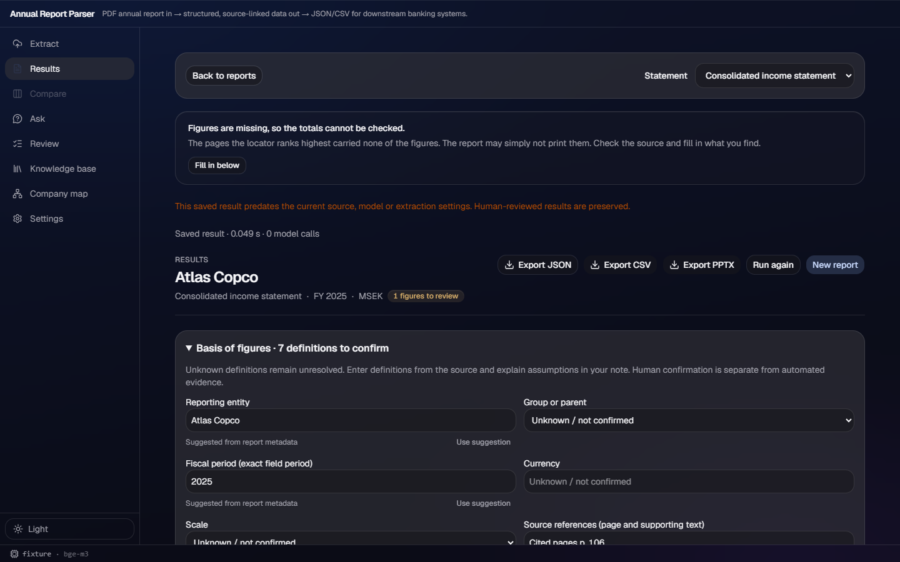
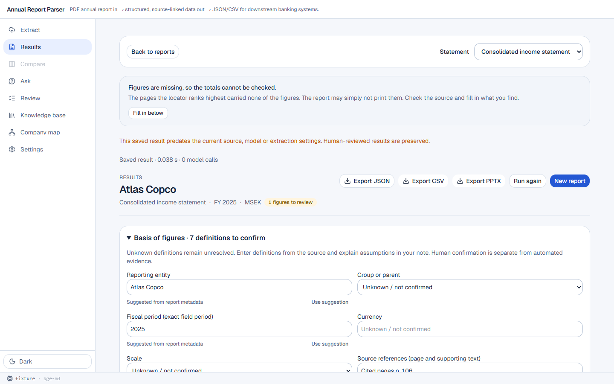
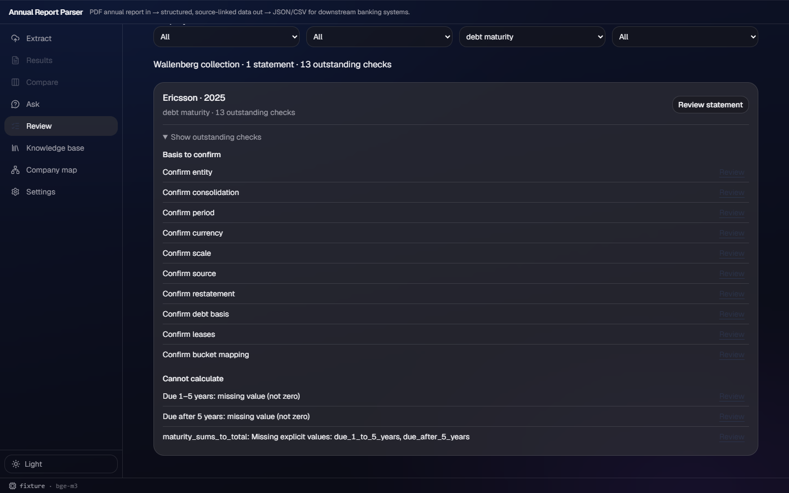
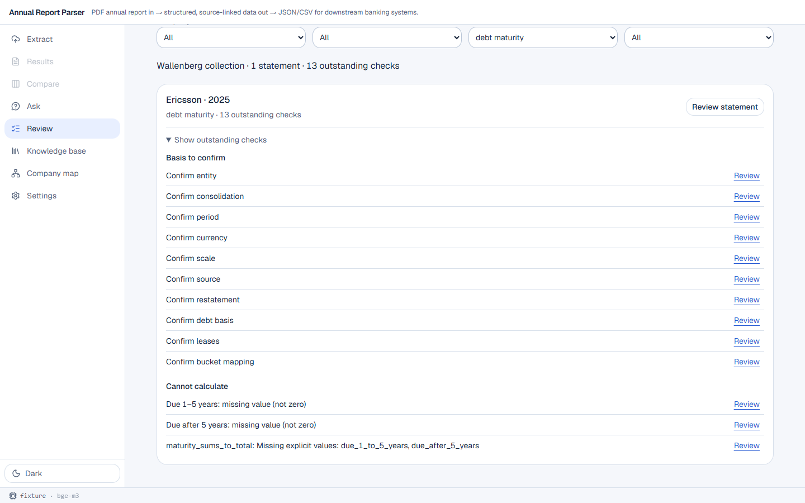

# v182 — statement-first review

## Delivered

- `decorate()` now emits conservative `basis_suggestions` with a source for every value. Report
  metadata supplies only entity and fiscal period; unanimous parsed field units can supply currency
  and scale; a complete cited field set can supply the cited-page list. Debt measurement needs a
  named maturity basis or a direct carrying/undiscounted quote, and native bucket mapping needs one
  cited header that explicitly names all three standard intervals. Consolidation, leases, and
  restatement are never suggested. Suggestions never change `issues` or `ready`.
- Basis review preloads those suggestions, shows `Suggested from p. N` or `Suggested from report
  metadata`, and provides a per-field **Use suggestion** action. Reviewer name and note remain
  required for the separate confirmation request.
- Review has one card per report/statement and groups its rows under explicit **Basis to confirm**,
  **Numeric conflicts**, **Missing evidence**, and **Cannot calculate** headings. The card opens a
  basis issue first when present.
- Results adds **Next unresolved field**. It changes only the selected field; a failed save remains
  on that field, the typed reviewer name survives moving to the next field, and the Review queue's
  selected filters are held by `App` while Results is open.

## API and real saved-data probe

`docs/API.md` and the mirrored frontend type define `BasisSuggestion` as
`{key, value, source: Source | "report metadata"}`. The saved-data probe over all 105
`debt_maturity` extractions made no model or PDF request and found this key distribution:

| Suggested key | Records |
| --- | ---: |
| entity | 105 |
| period | 105 |
| currency | 92 |
| scale | 92 |
| source | 93 |
| debt_basis | 103 |
| bucket_mapping | 0 |

The zero bucket-mapping result is intentional: none of those saved citations contained one header
that explicitly proved all three standard intervals. The new unit-mismatch and synthetic-header
assertions cover both the refusal and positive paths.

## UAW reference

Reviewed `demo:src/workbench-shell/renderer/themes/theme-acrylic.css` sections 1–4 and the
suggestion-row layout in `renderer/styles.css`. UAW has no reusable report-review, basis, or queue
component. This work uses the existing app cards, tokens, and one thin material rather than adding
another glass surface or new CSS.

## Red → green

- **Red:** the new workbench assertion accessed `basis_suggestions` on the pre-change decorated
  statement and failed because the field did not exist.
- **Green:** `python test_workbench.py` now proves sourced positive suggestions, unit mismatch
  refusal, absence of uncited field-derived suggestions, never-suggested scope choices, and that an
  analyst marking an undisclosed bucket unresolved cannot make the identity pass or the statement
  ready.
- The focused browser case proves one multi-issue statement card, all four category headings,
  source-labelled prefill without Ready, failed-save retention, next-field reviewer retention, and
  Review filter retention. Full frontend E2E passed **55/55**.

## Screenshots

Both tones use the fixture backend and saved report data; no model inference was requested.

`basis-dark.png` shows report-metadata suggestions already in the form while the statement still
has seven definitions to confirm.

`basis-light.png` shows the same prefill and per-field Use suggestion controls in light tone.

`queue-dark.png` shows one debt statement card with the shared basis group and a separate
Cannot-calculate group for missing figures; the E2E fixture additionally exercises numeric conflict
and missing-evidence headings.

`queue-light.png` verifies the same grouped-card treatment in light tone.

## Gates and companion cleanup

- `npm run build` passed.
- `npm run lint` passed (only existing advisory warnings).
- `npm run e2e` passed: **55 tests**.
- All 15 backend suites passed (collection, human review, workbench, and the 12 pipeline suites).
- Separate companion commit `e320636` changes the v177 targeted-fill test screenshot to the
  gitignored E2E output directory, so ordinary E2E runs no longer overwrite committed evidence.
