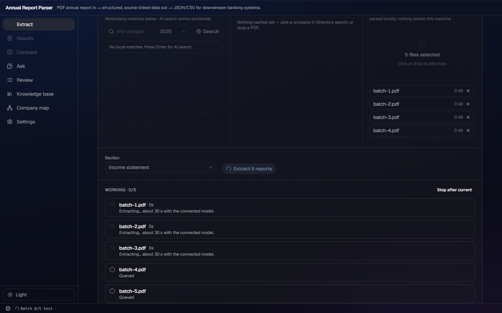

# v187 — merged E2E repair evidence

Base: `origin/ao/vivicta-seb-98/merge-team-7` at `6c7f151` (the merge containing
Sebastijan's #7). Verification used the fixture backend and the lane Vite proxy on ports
8105/5105; no model provider was configured or called.

## UAW reference

Reviewed UAW `demo:src/annual-report/` (the extraction/PDF primitives) and
`src/workbench-shell/renderer/themes/theme-acrylic.css` (the existing material tokens).
Neither contains a reusable React report-picker, batch queue, or basis-review component.
This repair retains the app's existing one-pane acrylic components; no UAW code was copied.

## Red → green

The focused pre-change run had **6 passed / 4 failed**:

| Red case | Actual cause | Repair and green evidence |
| --- | --- | --- |
| `one statement card keeps sourced basis hints, categories, reviewer and filter` | Its mock used the superseded `issues`/`basis_suggestions` contract. The merged backend keeps basis tasks in `basis_issues` and defaults in `basis_suggested`; the form therefore had no initial entity value. | The test now asserts independent basis tasks, dictionary prefill (`Group`, `Annual report`, `As reported`), and retains the source-backed hint/action. Focused spec: **5 passed**. |
| `extract: five uploads run three at a time` | `useBatch.start()` awaited each item in one loop, so five uploads became serial and the assertion saw all five begin instead of exactly three. | Three workers share a synchronous queue cursor. A worker claims another report only after its prior one settles; the focused spec proves peak three and source-order results: **3 passed**. |
| `directory picks fetch once with the PDF download on` | The assertion expected an automatic Results navigation. The merged UI deliberately leaves the completed batch on Extract and offers **View results (1)**. | The test follows that visible action before asserting the result; focused case: **1 passed**. |
| `a fetch error is shown with the URLs tried, never retried` | The current batch row presents URL diagnostics in a collapsible **tried 1 URL** detail, not the stale `Atlas Copco: tried 1 URL` sentence. | The test expands the real detail and verifies the attempted URL plus the single `download_pdf: true` request; focused case: **1 passed**. |

The three-wide queue means the active set can contain three reports when **Stop after current**
is pressed. Its regression now proves those active reports finish, while later queued reports are
marked skipped and never reach `/extract`. The complete batch-progress spec passed **3/3**.

## Visual proof

The screenshot was captured only after the batch list had three visible `Extracting…` rows and
two `Queued` rows. It shows the intended bounded-concurrency state without a forced navigation.

## Final verification

- Playwright full suite (`E2E_BASE_URL` set to the lane Vite URL): **59 passed, 0 failed** (1.9 min).
- `npm run build`: passed (`tsc -b` and Vite production build).
- `npm run lint`: exit 0; 13 pre-existing advisory warnings, none from this repair.
- `data/kb` and `data/reports` remained unchanged. The shared PDF copy and local service logs are ignored.

## Commits

- `4245498` — statement-card E2E follows independent basis semantics.
- `01a8d88` — PDF success E2E opens explicit batch results.
- `b31ed14` — PDF failure E2E checks the actual URL detail.
- `14773ba` — extra uploads run three-wide, with batch-progress regressions updated for that explicit concurrency.
