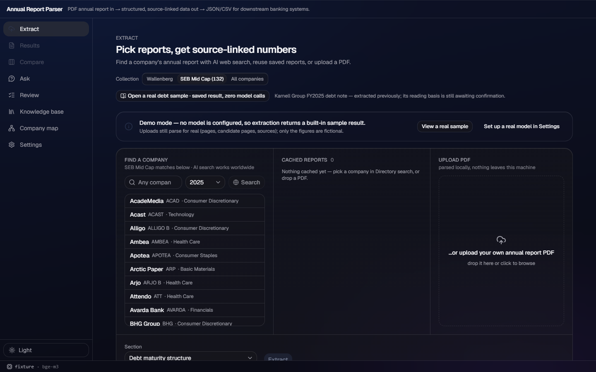
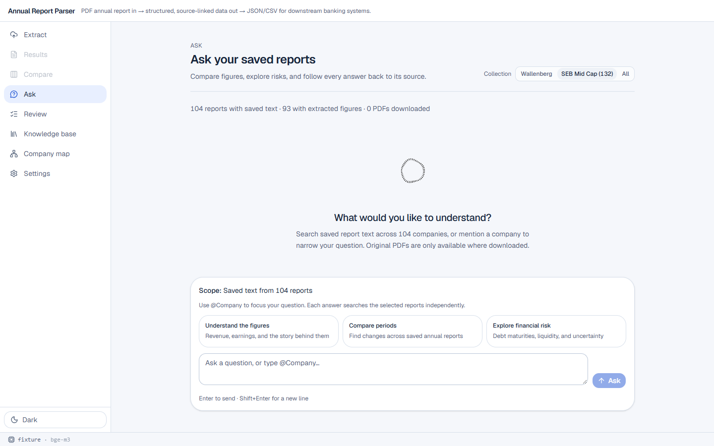

# v188 — Collection corners: Extract directory and global Ask

## Result

Both remaining collection entry points already follow the shared `wallenberg` / `midcap` /
`all` choice, so this lane adds direct regression coverage rather than duplicate picker or API
wiring.

- **Extract local company search — already follows:** `UploadView` passes its shared collection to
  `getCompanies(query, collection)`. `GET /api/companies` applies the existing
  `collection_name` scope, so changing to SEB Mid Cap clears the old list and shows only Mid Cap
  directory matches.
- **Global Ask — already follows:** `AskView` loads its catalog through `getKb(collection)` and
  gives that filtered catalog to `AskPanel`. A global question is therefore sent as explicit
  `report_stems` from that catalog, never as an unbounded Ask request. No `/api/ask` collection
  parameter is needed or added: its documented explicit-stem contract is already the narrower
  scope.
- The #7 AI discovery action remains explicitly worldwide (`CompanySearch` says so in the UI).
  This lane leaves that discovery algorithm unchanged; the collection contract audited here is the
  listed-company directory and the saved-report Ask corpus from consult item 5.

## Focused E2E observation

`frontend/e2e/tests/collection-corners.spec.ts` adds the two requested probes:

1. Switch Extract to SEB Mid Cap, search `ac`, and prove the directory request carries
   `collection_name=midcap` while Acast is visible and ABB is absent.
2. Switch global Ask to SEB Mid Cap, prove the company mention list excludes ABB, then prove an
   unmentioned question sends only `['acast_2025']` as `report_stems`.

**Red → green:** the probes were written against the #7 baseline and were green on their first
execution: **2 passed**. There was no pre-existing red behavioral failure to repair, so no
production code or API contract was changed and no artificial red run was manufactured. The
actual fixture backend separately returned Acast for the Mid Cap directory query and no Acast row
for the Wallenberg query.

## UAW reference

Reviewed `demo:src/workbench-shell/renderer/themes/theme-acrylic.css`, sections 1–3 (transparent
fallback, acrylic tokens, and the one-thin-material rule), plus the UAW tree for reusable
collection/search/Ask UI. It has no reusable component for this app-specific collection flow.
No UAW CSS or layout was copied: the existing picker and established acrylic surface remain
unchanged.

## Screenshots

The dark Extract capture shows the selected SEB Mid Cap picker and its Mid Cap-only directory
(including Acast).

The light Ask capture shows the same selected picker, `104 reports with saved text`, and a scope of
`Saved text from 104 reports`.

## Verification

- Focused E2E: `2 passed`.
- Fixture-mode live directory probe: Mid Cap `acast` returned Acast; Wallenberg `acast` returned
  no rows.
- `npm run build` passed. `npm run lint` passed with 13 existing advisory warnings.
- All 15 backend suites passed in fixture/offline mode.
- No model inference was requested.

### Full frontend-suite follow-up

The first 61-test E2E run found three pre-existing contract drifts. Two are in this lane's E2E
territory and are now green in focused reruns: the Analyst Workbench mock now supplies both the
documented `basis_suggested` prefill and `basis_suggestions` metadata, and the PDF-flow checks use
the application's explicit `View results` handoff plus its current URL-count label.

The remaining failure is intentionally not hidden: the existing five-upload concurrency test
exposes that `useBatch` currently awaits each `runItem` serially, contradicting the documented
three-wide queue. That hook is outside this lane's assigned files; the finding has been reported
for a scope decision before a final full-suite rerun.
