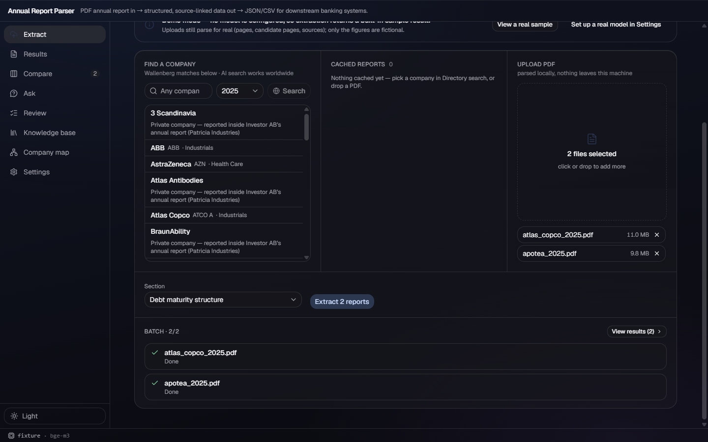

# w204 — text-layer annual reports no longer fail on image-only pages

## Root cause and fix

`parse.page_texts()` used the per-page `_looks_scanned()` result to decide whether to invoke OCR.
That made an image-only cover inside an otherwise native-text annual report enter the OCR path;
when `eng`/`swe` data was absent, that one page's `OCRUnavailable` aborted the entire registration.

The parser now classifies the **whole PDF** first. A report is native-text when at least **20% of
its pages contain at least 200 alphanumeric characters**. For such a report, image-only pages are
returned as blank text and recorded in `ocr_pending`; registration never OCRs them. Only a report
that fails that whole-book rule uses the bounded/full OCR path from v191.

On that OCR path, absent language data records the attempted page in `ocr_unavailable` and returns
blank text instead of failing registration. Extraction returns 422 only when every selected page
is unavailable (or the whole report has no readable text); a mixed set drops the unavailable pages
and continues with the readable candidates. The 422 tells an installed user to reinstall/update
the app or provide `TESSDATA_PREFIX` — it no longer suggests running a repository script.

`PARSER_VERSION` is 10 so old page caches cannot hide the new classification/provenance behavior.

## Red then green

The new synthetic regression is a five-page PDF: page 1 is a raster-only cover, pages 2–5 have a
substantial native text layer. With no tessdata, the pre-fix implementation failed during
`pipeline.test_maturity_ocr` with:

```text
OCRUnavailable: Scanned PDF needs OCR language files. Run python scripts/setup_ocr.py (missing: eng, swe).
```

After the fix the same check passes with page 1 blank, `ocr_pending == [1]`,
`ocr_unavailable == []`, and every body page readable. The HTTP regression additionally proves:

- a fully scanned upload without language files registers 200 and persists
  `ocr_unavailable == [1]`;
- extraction with that sole candidate returns the packaged-safe 422 and never calls the model;
- candidates `[unavailable, readable]` continue with the readable page rather than returning 422.

With the real files and an explicitly missing tessdata directory, whole-book classification was:

| PDF | Pages | Pages with >=200 alphanumerics | Registration provenance |
| --- | ---: | ---: | --- |
| `atlas_copco_2025.pdf` | 174 | 172 (98.9%) | `ocr_pending: [1]`, none unavailable |
| `apotea_2025.pdf` | 136 | 126 (92.6%) | `ocr_pending: [27, 94, 136]`, none unavailable |

## OCR resources in the distributable

`desktop/scripts/prepare-resources.js` now stages `eng.traineddata`, `swe.traineddata`, and their
license separately at `resources/tessdata`. It copies a developer cache when present; on a clean
build tree it downloads the official `tessdata_fast` files and fails the build rather than silently
shipping a broken OCR installation. `electron-builder.yml` includes that resource, the shell points
the packaged backend to it, and `paths.tessdata_dir()` resolves explicit `TESSDATA_PREFIX` first,
then packaged resources, then writable/source `data/tessdata`.

The clean-builder path was exercised before creating a developer cache: resource preparation
downloaded and staged `eng.traineddata` (**4,113,088 bytes**) and `swe.traineddata`
(**4,167,034 bytes**) at the packaged location, with no duplicate under staged `data/`.

Reference check: the UAW `demo` tree has general Windows packaging patterns but no OCR/tessdata
resource implementation, so no UAW OCR code was copied; this extends this repository's existing
`prepare-resources.js`/Electron resource pipeline.

## Final packaged-app acceptance

After merging the latest `origin/acrylic`, the backend, frontend and Electron shell were rebuilt.
The resulting unpacked app was copied to this lane's own `<uaw-lanes>/vivicta-seb-120/app`, then
launched in fixture mode with a newly created isolated userData directory. Its bundle contained
both language files under `resources/tessdata`.

Two real annual reports were selected together in the packaged UI:

- Atlas Copco FY2025, 174 pages, SHA-256 prefix `70d076bd915e`;
- Apotea FY2025, 136 pages, SHA-256 prefix `c67164b123f7`.

Both registration requests, candidate requests and fixture extraction requests returned **200**.
Both batch rows visibly reached **Done**. The packaged parser-10 metadata matched the direct check:
Atlas pending page 1; Apotea pending pages 27/94/136; neither had `ocr_unavailable` or `ocr_pages`.



The app window was closed gracefully after capture; no lane app/backend process remained. No
tracked `data/` file changed.

## Verification

- No tessdata: `pipeline.test_maturity_ocr` green (real-OCR v191 branch skipped as designed) and
  `pipeline.test_runtime` **16 tests green, 2 skipped**.
- With tessdata: the same two suites green with real bounded/full/on-demand OCR exercised;
  `pipeline.test_runtime` **16 tests green, 0 skipped**.
- Full backend gate: **16/16 modules green** (`pipeline.test_confidence`, `test_debt_selection`,
  `test_fetch`, `test_global_ask`, `test_jobs`, `test_kb`, `test_llm`, `test_locate`,
  `test_maturity_ocr`, `test_merge`, `test_parse`, `test_paths`, `test_runtime`, plus root
  `test_collection`, `test_human_review`, `test_workbench`).
- Desktop: `data-sync.test.js` 6/6, `port.test.js` 4/4, `updates.test.js` 2/2, and
  `packaging.test.js` green with the tessdata resource/path guards.
- `npm run build` green; `npm run lint` green with 13 pre-existing warnings; `npm run pack` green.

## Baseline

Started from `origin/acrylic` at `93c1e86`. Before final packaging, fetched `origin` and
`team/main`, then merged current `origin/acrylic` at `b9f3c65` without conflicts. `team/main`
(`d7b1d73`) was behind acrylic and introduced nothing further to reconcile.
