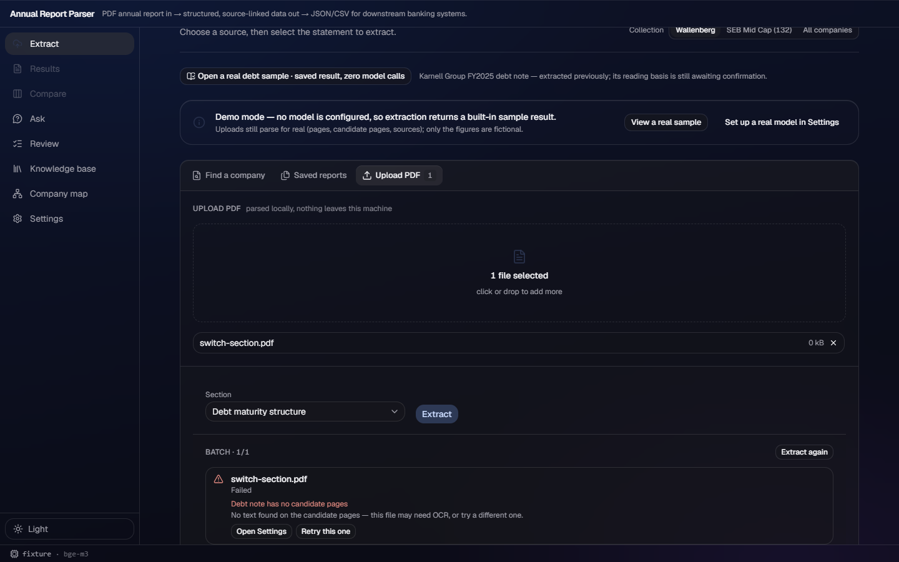

# w210 — failed batch does not block another section

## Scope

The Extract workspace now leaves a settled failure readable, while making the next
run explicit and independent:

- `useBatch.reset()` discards only the settled queue state.
- Changing the Section resets that state before the next section is submitted.
- `BatchProgress` keeps an **Extract again** action whenever no queue items remain,
  alongside the existing per-item Retry and Stop-after-current behaviour.

`backend/app.py` was inspected but not changed. Its saved-result path is already
per section (`extractions/<section>.json`), so debt maturity and income statement
results for one report do not share a cache entry.

## UAW reference

Reviewed `demo:src/workbench-shell/renderer/themes/theme-acrylic.css`. The change
uses the existing one-pane acrylic workspace and existing button surfaces; it adds
no new material, tokens, or private card background.

## Red → green

- **Red:** the new focused Section-switch spec on the dispatch baseline had **1
  failed, 1 passed**. After the mocked `debt_maturity` 422, the failed row and raw
  error appeared, but no **Extract again** action existed.
- **Green:** after the change, the same focused spec had **2 passed**. It verifies
  a failed debt run remains visible, changing to income clears only that settled
  batch, and income starts normally. Its second case sends `debt_maturity` then
  `income_statement` for the same report id and receives independent section
  results.

The screenshot was captured after the failed row and **Extract again** action were
visible. It demonstrates that the error is retained rather than silently hidden.

## Verification

- Focused Playwright: `extract-batch-progress` (4) plus
  `extract-section-switch` (2): **6 passed**.
- Full Playwright/Edge fixture run: **84 passed, 2 skipped**. The skips are the
  existing cached-PDF cases, skipped when their optional local report is absent.
- Backend: all **19** self-check modules passed (6 root modules and 13 pipeline
  modules). The selective-OCR suite reported its expected language-data skip; no
  model provider was used.
- `npm run build`: passed.
- `npm run lint`: exit 0 with 13 pre-existing advisory warnings; none are from
  these files.

## Files

- `frontend/src/hooks/useBatch.ts`
- `frontend/src/components/UploadView.tsx`
- `frontend/src/components/upload/BatchProgress.tsx`
- `frontend/e2e/tests/extract-section-switch.spec.ts`
- `docs/acrylic/evidence/w210.md`
- `docs/acrylic/evidence/w210/failed-batch-extract-again-dark.png`

No API contract, backend source, or `data/kb` content changed.

## Final integration

Fetched and merged the latest `origin/acrylic` at `6d2d724` without conflicts.
After that merge, the final gates were re-run: **19/19** backend modules,
build, lint, and Playwright (**84 passed, 2 expected cached-PDF skips**).
